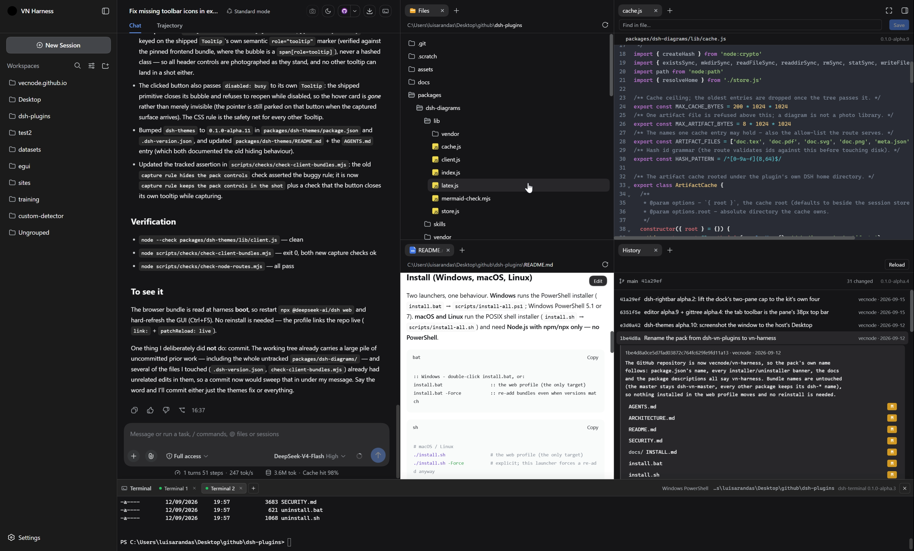
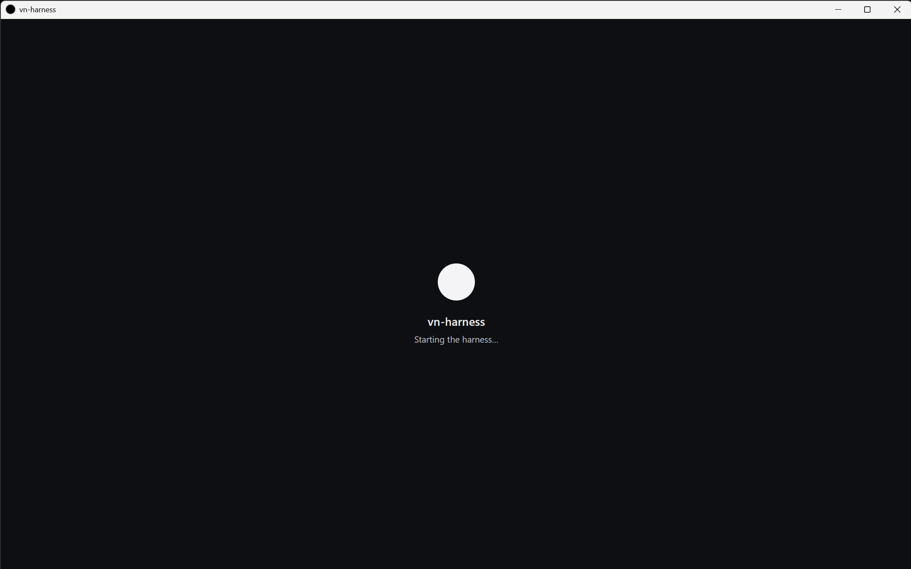
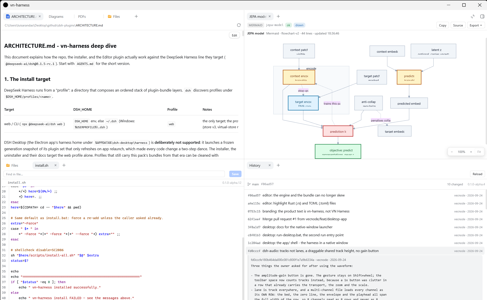

# 🤖 vn-harness


Plugin pack for **DeepSeek Harness**.

Everything ships as standard **dsh bundles**. The plugins are
plain JavaScript, and the launchers run on **Windows, macOS and Linux** — the
Windows half is PowerShell, the macOS/Linux half is plain POSIX shell.



<p align="center">
  
  
  <br>
  <em><code>run-desktop.bat</code>: the shell's splash while <code>npx</code> works, and the same window once the harness is listening.</em>
</p>

## Plugins (all **alpha**)

Each package's own README is the reference for what it does, why it is built that
way and what it touches; the table below is the map.

| Package | What it does | Status |
|---|---|---|
| [`dsh-vn-master`](packages/dsh-vn-master/README.md) | [`README.md`](packages/dsh-vn-master/README.md) | alpha `0.1.0-alpha.1` |
| [`dsh-rightbar`](packages/dsh-rightbar/README.md) | [`README.md`](packages/dsh-rightbar/README.md) | alpha `0.1.0-alpha.2` |
| [`dsh-rightbar-files`](packages/dsh-rightbar-files/README.md) | [`README.md`](packages/dsh-rightbar-files/README.md) | alpha `0.1.0-alpha.1` |
| [`dsh-editor`](packages/dsh-editor/README.md) | [`README.md`](packages/dsh-editor/README.md) | alpha `0.1.0-alpha.9` |
| [`dsh-gittree`](packages/dsh-gittree/README.md) | [`README.md`](packages/dsh-gittree/README.md) | alpha `0.1.0-alpha.4` |
| [`dsh-image`](packages/dsh-image/README.md) | [`README.md`](packages/dsh-image/README.md) | alpha `0.1.0-alpha.1` |
| [`dsh-audio`](packages/dsh-audio/README.md) | [`README.md`](packages/dsh-audio/README.md) | alpha `0.1.0-alpha.1` |
| [`dsh-diagrams`](packages/dsh-diagrams/README.md) | [`README.md`](packages/dsh-diagrams/README.md) | alpha `0.1.0-alpha.6` |
| [`dsh-pdf`](packages/dsh-pdf/README.md) | [`README.md`](packages/dsh-pdf/README.md) | alpha `0.1.0-alpha.3` |
| [`dsh-terminal`](packages/dsh-terminal/README.md) | [`README.md`](packages/dsh-terminal/README.md) | alpha `0.1.0-alpha.3` |
| [`dsh-themes`](packages/dsh-themes/README.md) | [`README.md`](packages/dsh-themes/README.md) | alpha `0.1.0-alpha.13` |
| [`dsh-modal`](packages/dsh-modal/README.md) | [`README.md`](packages/dsh-modal/README.md) | alpha `0.1.0-alpha.1` |
| [`dsh-open-in-app`](packages/dsh-open-in-app/README.md) | [`README.md`](packages/dsh-open-in-app/README.md) | alpha `0.1.0-alpha.1` |

> The pack used to ship its own Files panel (`dsh-files`, earlier `dsh-focus`)
> with a private dock and header capsules; that was retired when the harness
> grew a real right Sidebar. Now the pack goes one step further and **owns the
> bar itself** by forking it — see `packages/dsh-rightbar/README.md` and the
> `scripts/sync-vendored.ps1` re-sync path. The same fork-and-disable scheme
> owns the **file-manager half of Open In…** (`dsh-open-in-app`).
>
> The pack's **master** is a bundle of its own, `dsh-vn-master`, and it is
> deliberately blank: the bundle layer plus one no-op row, with no browser half,
> no service and no inject edge. So the right bar keeps only bar
> responsibilities, and the master — installed last — is where pack-wide patches
> go.

## Quick start

Three commands take you from a fresh clone to a running app. Everything else in
this repository is documentation.

**What you need:** Node.js 22 or newer, with `npm`/`npx`. That is the whole
requirement. Chrome is optional — the launcher falls back to your default
browser. Three features have optional extras: the **History** tab needs `git` on
`PATH`, TikZ diagrams need a TeX engine (`pdflatex`, `xelatex` or `lualatex`),
and **PDF page pictures** (`pdf_render`) need a rasterizer (`pdftoppm` from
poppler, `mutool`, or Ghostscript). Without them, the rest of the pack works
unchanged — reading and searching a PDF needs nothing at all, because the pdf.js
engine is vendored inside `dsh-pdf`.

**Windows** uses the `.bat` files, **macOS/Linux** the `.sh` ones — and the Unix
side never needs PowerShell.

| Step | Windows | macOS / Linux | What it does |
|---|---|---|---|
| **1. Install** | `install.bat` | `./install.sh` | adds every bundle under `packages/` to the web profile (`~/.dsh/profiles/web`) and copies the bundled skills into `~/.dsh/skills` |
| **2. Run** | `run.bat` (double-click) | `./run.sh` | starts `npx @deepseek-ai/dsh@<pin> web` and opens the URL it prints — token included — in **Chrome**, falling back to the default browser |
| **2b. Run (desktop)** | `run-desktop.bat` (double-click) | `cargo build --release` in `app/src-tauri` | the **same** harness in a native window instead of a browser tab: builds the small Rust/Tauri shell under `app/` when it is out of date, then starts the same pinned server on the harness's own default port when it is free (a free one otherwise) and shows it in a WebView2 / WKWebView / WebKitGTK window |
| **3. Remove** | `uninstall.bat` | `./uninstall.sh` | removes the bundles, their patch layers and the skills the installer copied |

```bat
:: Windows - install/uninstall/run are all double-click friendly
install.bat                  :: installs into the web profile (the only target)
run.bat                      :: starts the harness and opens it in Chrome
                             :: (the entry point; scripts\run-web.ps1 does the work)
run-desktop.bat              :: the same harness in a NATIVE WINDOW instead of a
                             :: browser tab (cargo builds app\src-tauri first)
uninstall.bat                :: removes the pack
```

```sh
# macOS / Linux - from the repo root
./install.sh                 # the web profile (the only target)
./run.sh                     # start the harness and open it in Chrome
./uninstall.sh               # remove the pack
```

The run launcher keeps the harness in the foreground of that terminal, so the
app's own output — including the `dsh web: http://127.0.0.1:3080/?token=…`
line — stays visible and **Ctrl+C** stops it. Flags pass straight through:

- `-Port 3099` when port 3080 is already taken,
- `-DefaultBrowser` to skip Chrome,
- `-NoBrowser` to start the server without opening a browser at all.

The URL is opened only when it names a loopback address, and the launch token is
never written to a file — both rules are explained in [SECURITY.md](SECURITY.md).

**Prefer a window to a tab?** `run-desktop.bat` builds and runs the small
Rust/Tauri shell in [`app/`](app/README.md) and shows the harness in a native
WebView2 / WKWebView / WebKitGTK window. It is the same server, the same pin and
the same profile — nothing is bundled and no plugin knows the difference, so the
two launchers are interchangeable. The shell asks for the harness's **own default
port** when nothing holds it — the same origin a `run.bat` tab opens on, which is
what keeps the window's per-origin client state — and falls back to a free
loopback port when something already has it, so it never collides with a `run.bat`
server or the Web GUI. It opens its window immediately with a
splash while `npx` works, holds the launch token to the same two rules the
browser launcher does, and kills the harness when the window closes. It needs the
Rust toolchain ([rustup.rs](https://rustup.rs)) in addition to Node.js; the first
build compiles the shell's dependencies and takes a few minutes, after which it
is instant. The same shell compiles on macOS and Linux with
`cargo build --release` in `app/src-tauri`; only the Windows double-click wrapper
is committed so far.

Install flags: `-Force` re-adds bundles even when the versions match.
`-Plugin` / `-DshHome` / `-ProfileName` / `-DshVersion` / `-Target web|cli`
behave as documented in [`docs/INSTALL.md`](docs/INSTALL.md), which also has the
no-script path:

```powershell
:: Windows (direct)
powershell -NoProfile -ExecutionPolicy Bypass -File scripts/install-all.ps1 -Force
```

```sh
# macOS / Linux (direct)
sh scripts/install-all.sh -Force
```

Both installer halves do the same work, and re-running them is safe:

1. pin the dsh version from `.dsh-version.json` and run everything through
   `npx @deepseek-ai/dsh@<pinned>`,
2. reuse a system pnpm when it is new enough for the profile, else bootstrap a
   private copy under `./tools` (no admin rights, nothing global),
3. resolve the web profile (`$DSH_HOME/profiles/web`, `$DSH_HOME` = env var or
   `~/.dsh`),
4. **prune retired bundle names** (`dsh-focus`, `dsh-files` — the pack's own
   Files panel, now shipped by the harness itself) so an upgrade cannot
   double-mount,
5. run `dsh plugin --profile web add <bundle>` for every package under
   `packages/` (bundles already at the repo version are skipped unless `-Force`),
6. **copy the skills a bundle ships** (`packages/<bundle>/skills/<name>/SKILL.md`)
   into `$DSH_HOME/skills`, where the harness' own filesystem skill provider
   reads them. Every folder the installer creates carries a marker file, so a
   person's own skill of the same name is never overwritten and uninstall only
   removes what it wrote,
7. print next steps. Neither half touches API keys — add yours in
   **Settings → Models**.

To remove the pack, run **`uninstall.bat`** (Windows) or **`./uninstall.sh`**
(macOS/Linux); both take the same `-Plugin` / `-DshHome` / `-ProfileName`
switches. Removing a bundle also removes its patch layer.

## Notes

- **Alpha software, on purpose.** Every package ships as `-alpha.N`, and the
  pack is built and tested against the one harness line pinned in
  `.dsh-version.json` (`0.1.5-rc.1`) — never against `latest`. `dsh-rightbar`,
  `dsh-rightbar-files` and `dsh-open-in-app` are **forks** of that line's client
  bundles, so a pin bump is a deliberate step: bump the pin, run
  `scripts/sync-vendored.ps1` to move the forks forward, then re-verify (see
  `packages/dsh-rightbar/README.md`). `dsh-open-in-app` is the one fork that is
  not byte-for-byte — its documented patches live in `sync-vendored.ps1`.
  `sync-vendored.ps1` is **maintainer tooling**, and the one script in this repo
  that wants PowerShell 7 (`pwsh`) on macOS/Linux; the installers never do.
- **Plain JavaScript, no build step.** The UI halves are hand-written
  module-table bundles, so the edit → restart loop stays instant. A few files
  are **generated and never hand-edited**: the three forked bundles
  (`dsh-rightbar/lib/client.js`, `dsh-rightbar-files/lib/client.js`,
  `dsh-open-in-app/lib/client.js`) and the engines the pack vendors and serves
  itself — `dsh-editor`'s **CodeMirror 6**, `dsh-diagrams`' **Mermaid** (rebuilt
  by `packages/dsh-diagrams/vendor/build.mjs`), `dsh-pdf`'s **pdf.js** (engine,
  worker, cMaps and standard fonts, rebuilt by
  `packages/dsh-pdf/vendor/build.mjs`) and `dsh-terminal`'s **xterm.js**
  with its stylesheet.
- **Making a change visible.** After editing a `client.js`, restart
  `npx @deepseek-ai/dsh web` and hard-refresh the browser (Ctrl+F5). The web
  profile installs every bundle as a **live link** into this repo, so the edit is
  already "installed" — but the bundle is read once, at app boot. A plain
  `install.bat` / `./install.sh` re-syncs every bundle whose version in this repo
  changed (bump `package.json` + `.dsh-version.json` first); `-Force` re-adds
  regardless, which is what a changed package **set** needs. There is no hot
  reload unless a `pnpm run dev:web` watcher from the harness repo is running.
- **Running it.** `run.bat` / `./run.sh` start the pinned `dsh web` with
  `--no-open`, read the `dsh web: http://127.0.0.1:<port>/?token=<token>` line
  the app prints once it is listening, and open **that** URL in Chrome (the
  default browser is the fallback). A URL that does not name a loopback address
  is refused instead of opened, and the launch token — a live credential for the
  running process — is only ever held in memory: never written to a file, never
  passed through a shell. On Windows `run.bat` is the double-clickable entry point
  and `scripts/run-web.ps1` the worker behind it, because cmd cannot watch a
  running child's output; [SECURITY.md](SECURITY.md) describes the whole access
  model and how to lock the app down. **Running it in a window instead:**
  `run-desktop.bat` does the same job with a webview in place of the browser
  hand-off — the watching half is Rust ([`app/`](app/README.md)), so it is one
  batch file with no PowerShell worker, and it holds the launch token to the same
  rules.
- **Where to read more.** [`docs/INSTALL.md`](docs/INSTALL.md) has the manual
  install path and troubleshooting, [`docs/COMPATIBILITY.md`](docs/COMPATIBILITY.md)
  the supported harness line, and each package's own README the details of that
  plugin — [`ARCHITECTURE.md`](ARCHITECTURE.md) has a section per plugin,
  including [§16 the PDF plugin](ARCHITECTURE.md#16-the-pdf-plugin-dsh-pdf).

## Security & license

- MIT — see [LICENSE](LICENSE). Plugins are authored by **vecnode**.
- Security policy (supported line, private reporting, hardening expectations):
  [SECURITY.md](SECURITY.md). This pack never touches API keys and never patches
  DeepSeek core files: it adds its own rows and (for the right bar) disables the
  shipped rows, then supplies its own copied bundles.

## Repository layout

```
AGENTS.md              quick-start brief for coding agents working in this repo
ARCHITECTURE.md        deep dive: plugin model, the right bar fork, the editor tab, installer
LICENSE                MIT license (vecnode)
SECURITY.md            security policy: supported line, private reporting, hardening
.gitattributes         keeps the .sh launchers LF (a CRLF shebang breaks them)
packages/dsh-vn-master/  the one bundle with NO client half - the blank master layer
packages/<bundle>/     one standalone dsh bundle (package.json + cordis.patch.yml + lib/)
  lib/index.js         Node half (may be a no-op row so the client bundle ships)
  lib/client.js        Browser half (module-table bundle; hand-written or GENERATED fork)
scripts/               install-all.ps1 / uninstall-all.ps1 (Windows PowerShell)
                       and install-all.sh / uninstall-all.sh (POSIX sh for
                       macOS/Linux), plus sync-vendored.ps1 (maintainer fork
                       re-sync) and the .bat / .sh console twins
  checks/              standalone verification for the JS halves (see its README)
.dsh-version.json      the pinned harness line + per-package versions
install.bat / .sh      installer       |  uninstall.bat / .sh  remover
run.bat / run.sh       starts the app and opens it in a browser
run-desktop.bat        the same app in a native window (builds + runs app/)
app/                   the Rust/Tauri desktop shell: src-tauri/ (the supervisor)
                       + ui/ (its splash). NOT a plugin and NOT installed into
                       any profile - a launcher for the web profile
scripts/make-desktop-icon.mjs  regenerates app/src-tauri/icons from
                       assets/vn-harness.svg (the icons are committed)
```
