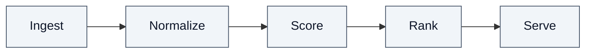
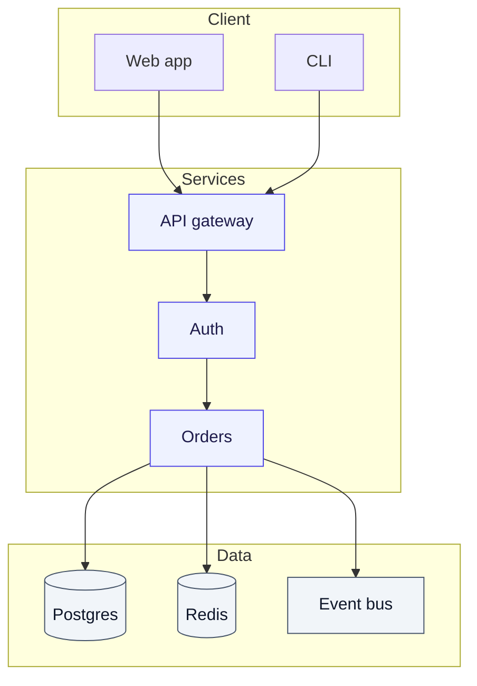
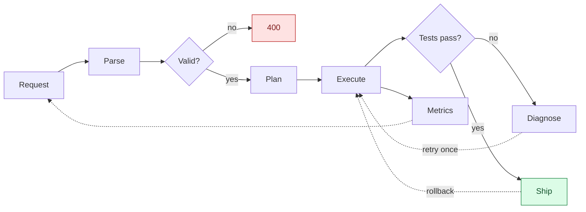
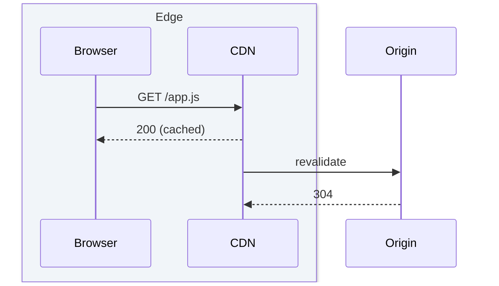
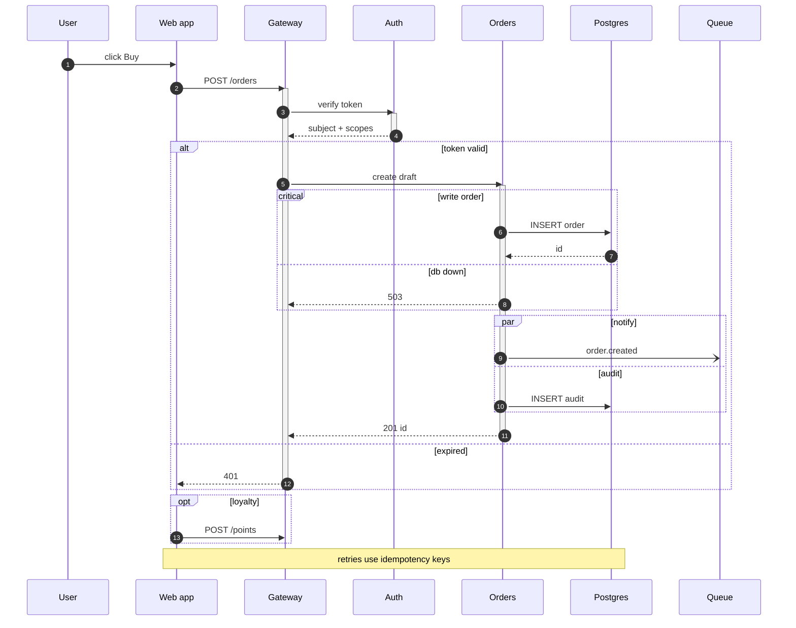
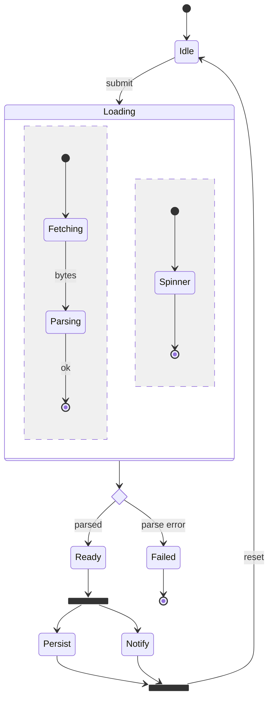
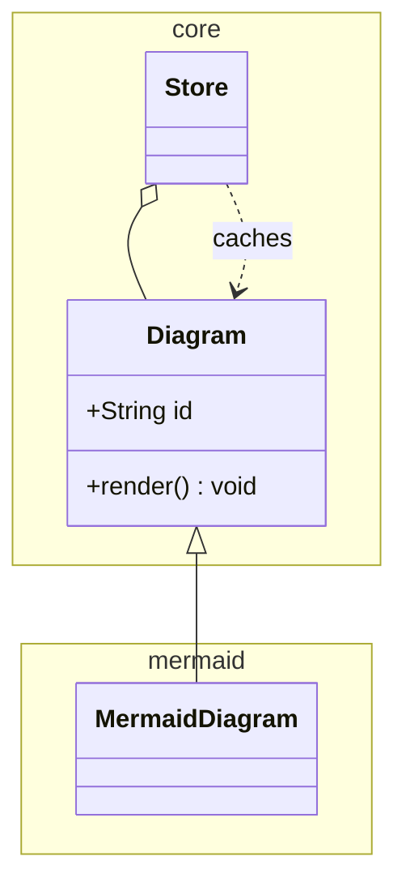
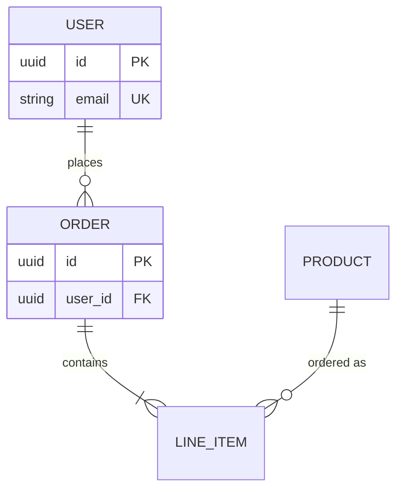
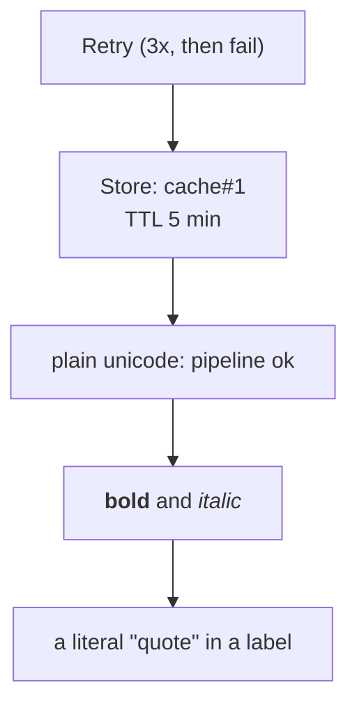
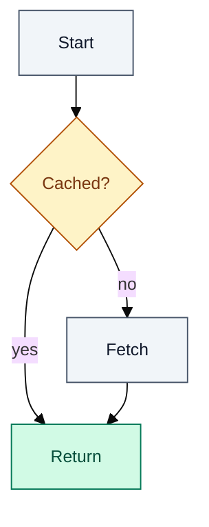

# Complex Mermaid diagrams

Depth behind `SKILL.md` for sources that do not fit in one glance. Assumes the
`diagram_write` / `diagram_patch` / `diagram_read` / `diagram_verify` loop, the `status`
values `ok | error | unavailable`, and the split between `status` (does it parse?) and
`verification.state` (did a browser draw it?). The panel is 360-560px wide, the default view
fits the picture to 80% of that width, and it renders in light and dark; every number below
is sized for that box. A zoom ladder (25%-400%) and drag-to-pan exist, but do not design for
them - a diagram that needs 300% to be read is a diagram to split.

## 1. Budgets and decomposition

| Picture | Target | Host lint threshold | Past it |
|---|---|---|---|
| flowchart | 12-20 nodes, <= 30 edges | *"About N nodes is past the point a reader takes in at once"* >20; *"...in one picture"* >40; *"N edges is a lot of lines to follow"* >60 | split by layer or phase |
| subgraphs | <= 5 | *"N subgraphs nest past what a narrow panel can show"* >6 | promote one to its own diagram |
| sequence | 5-7 participants | not linted | split by scenario, collapse the far side |
| state | <= 12 states, <= 2 nesting levels | not linted | one diagram per lifecycle phase |
| class / ER | <= 8 entities | not linted | split by aggregate or namespace |
| node label | <= 24 chars per line, 2 lines | *"A node label runs to N characters"* at 80+ | move detail into the accompanying message |

The node counter inspects **flowcharts only**, and only ids followed by a shape opener:
`A --> B` chains count as zero nodes, `A["x"]` counts, a subgraph title counts. Treat it as a
tripwire, not a layout budget. Nothing counts sequence, state, class or ER size; those budgets
are yours.

To split a 40-node picture: name the layers (entry, edge, services, data, or phase 1..n); write the **overview** with 5-9 nodes, one per layer boundary, dominant arrows only; then write one **detail** per layer (<= 12 nodes, `flowchart LR`, inputs left, outputs right) and give its title to the overview node that stands for it (`Score["Score (detail: score-tuning)"]`). Reuse the same node id for the same concept across the whole set.



A table beats a diagram when the question is which option wins on two numeric axes, when 30 rows share one shape, or when a list has no branches; prose beats it for an ordered list and for the internals of a single node. A flowchart earns its space when there is a branch or a fan-out - fewer than 3 nodes, or more than half with one edge in and one out, is a list wearing boxes.

## 2. Layering recipes

The ordering rules that decide the layout:

1. Line 1 is the keyword and direction: `flowchart TD`. No comment above it, no fence.
2. Declare each block as `subgraph Id["Title"]`; the **id** is what edges and `class` reference, the quoted **title** is what the reader sees.
3. `direction LR` (or `TB`) goes on the line immediately after `subgraph`, before any node.
4. Declare **every** node of that layer inside the block - a node's layer is fixed by the first line that creates it - and close with a bare lowercase `end` on its own line.
5. Emit all edges **after** the last `end`, so no node can change owner and cross-layer edges read as the long lines.
6. Order subgraphs along the reading direction: top layer first in `TD`, leftmost first in `LR`.
7. Put `classDef` lines last, then one `class A,B role` line per group.



The outer `TD` stacks the layers; the inner `direction LR` runs each layer's members across,
which keeps the picture short. If the layers connect many-to-many, the inner `LR` creates the
crossings you were avoiding - drop it instead.

Traps:

- **`end` is a keyword.** `A --> end` gives `Expecting 'AMP', 'COLON', 'PIPE', ... got 'end'`. Use `finish` or `stop`. **Every opener needs its own `end`**: `subgraph`, `loop`, `alt`, `par`, `critical`, `box`, `state X {`, class `}`. One missing `end` reports at the END of the source as `Expecting 'SEMI', 'NEWLINE', ..., 'end', ...` - count openers and closers.
- **A node created by an edge first stays at the top level.** `Web --> Gateway` written above `subgraph Client` parses without a warning and `Client` then draws EMPTY, because a node's layer is fixed at its first mention. Declare inside, then connect.
- `subgraph Title` without brackets makes the id and title one token, so a title with a space silently becomes two ids.
- A node cannot live in two subgraphs: keep it in its home layer and let the long edge say the rest. Nested subgraphs work but the second level costs more room than it explains in 360px - flatten.

## 3. Crowded flowcharts

- Label with `A -->|yes| B` (preferred) or `A -- yes --> B`. Past ~12 characters a label widens the edge lane and pushes the ranks apart.
- `-.->` means "not the main path" - retry, rollback, telemetry, cache refresh. `==>` marks the critical path. Two line styles per picture, never three. Back-edges read as feedback loops at 1-3 per picture; ten read as a hairball.
- **No label collisions.** Two labelled edges into the same target land in the same gap: name the outcome on the target (`E["Rejected: invalid or timeout"]`) instead of labelling both edges. A self-loop `A --> A` is fine for one retry and confusing beyond that.

| Shape of the picture | Direction | Why |
|---|---|---|
| pipeline, request path, dataflow, time-ordered stages | `LR` | ranks stack vertically and blow past the panel height |
| decision tree, escalation, approval chain | `TD` | branches fan downward without colliding |
| layered architecture | `TD` plus inner `LR` | layers stack, members run across |

A `TD` graph with 20 nodes becomes a 20-rank column, taller than the panel and uselessly zoomed out; longer than ~6 ranks, switch to `LR` or add subgraphs. Beyond that: subgraph every ~5 nodes, one decision diamond per 4-5 plain nodes, at most 2 incoming edges per node, no label on a back-edge, and drop leaves that only report status (`Metrics`, `Audit`) unless they change a decision.



## 4. Sequence diagrams at scale

Seven participants is the practical ceiling here: lanes stay wide enough for a 20-character
message. At ten, text wraps and every activation bar becomes a sliver. Collapse the far side
into one lane (`D as Data layer`), split by scenario (one diagram per `alt` branch you would
otherwise draw), and put assumptions in a `Note` rather than a longer label.

| Block | Use | Shape |
|---|---|---|
| `alt` / `else` | mutually exclusive outcomes | `alt label` ... `else label` ... `end` |
| `opt` | a conditional that changes nothing else | `opt label` ... `end` |
| `par` / `and` | genuinely concurrent work | `par label` ... `and label` ... `end` |
| `critical` / `option` | work that must complete, plus its failure branch | `critical label` ... `option label` ... `end` |
| `break` | an early exit | `break label` ... `end` |
| `loop` | repetition | `loop label` ... `end` |
| `rect rgb(r,g,b)` | a visual band, no semantics | `rect rgb(241,245,249)` ... `end` |

- `activate X` and `deactivate X` must pair. An unclosed activation runs to the bottom of the diagram and the renderer never complains - the reader misreads the lifetime.
- `autonumber` when the message order is the point; skip it when labels already number themselves. `Note over A,B: text` spans lanes, `Note over A: text` and `Note right of A: text` cover one; notes cost no lane width, so they are the cheapest place for the assumption the picture depends on.
- One `alt` per picture. Two nested blocks in 360px is where legibility ends.

- `box ... end` groups lanes under a caption and is fine to use: the headless validator handles it (it needs `window.CSS`, which the host's DOM stub provides). `box` takes an optional colour before the title - `box rgb(241,245,249) Team` - and the title is what the reader sees. It changes presentation only, so reach for it when the grouping is the point; otherwise `rect rgb(...)` (a band across the whole width) or a `Note over` is cheaper.



Seven participants, every block that earns its place:



## 5. State machines



- `[*]` is the entry marker left of an arrow, an exit marker right of one. One entry and many exits are normal.
- Composite: `state Name { ... }`. A `[*]` INSIDE the block is that composite's own start/end, unrelated to the outer one - the most common misread of a state diagram. `direction LR` on the first line inside the block is honoured.
- Concurrent regions: a bare `--` line inside a composite starts a second region running at the same time. One `--` per picture - two regions already halve the width each gets.
- `<<fork>>` and `<<join>>` must be declared (`state fan <<fork>>`). Keep them at the top level, not inside a composite; a fork with N outgoing edges returns through one `<<join>>`.
- `state outcome <<choice>>` draws a diamond. Use it when the guard on the edge is the interesting part; otherwise a plain state reads better.
- Transition labels are `A --> B: label`, one or two words, with no colon inside. A state name with a space needs an alias: `state "Waiting for input" as Waiting`.
- `stateDiagram-v2` is reported by the engine as `diagramType: "stateDiagram"` - not a type mismatch; both map to the same family.

## 6. Class and ER at scale



- `namespace name { ... }` is a visual grouping, not a package path; one level only.
- Relations: `<|--` inheritance, `*--` composition, `o--` aggregation, `-->` association, `..>` dependency, `..|>` realization, `--` a plain link.
- Members: `+` public, `-` private, `#` protected, `~` package. Parentheses make it a method, a bare name is a field, the return type follows the signature.
- Budget: <= 8 classes and <= 6 members each. Show the member that explains the relationship and delete the rest; label a relation only when the verb is not obvious from the cardinality.



| Cardinality | Reads as |
|---|---|
| `\|\|--\|\|` | exactly one to exactly one |
| `\|\|--o{` | one to zero or more |
| `\|\|--\|{` | one to one or more |
| `}o--o{` | zero or more to zero or more |
| `o\|--\|\|` | zero or one to exactly one |

- The left glyph describes the entity named on the left: `USER ||--o{ ORDER` reads "one USER may have zero or more ORDER". The `: label` is mandatory in practice; quote it when it has a space.
- Attribute keys `PK`, `FK`, `UK` are plain tokens after the type, a composite key is two `PK` lines, and nothing is enforced. Types are free-form words; stay inside `uuid`, `string`, `int`, `timestamp`, `json`.
- Budget: <= 8 entities and <= 4 attributes each. Past that, split by aggregate and mention the other key in the accompanying message.
- The `erDiagram` lint counts no entities or attributes, and its bracket check ignores `{}` blocks.

## 7. Labels and text at scale

Measured against the vendored engine by writing each character into an unquoted `A[...]`:

| Character | Unquoted | Fix |
|---|---|---|
| `(` `)` `@` | parse error (`got 'PS'`) | quote the whole label |
| pipe, double quote | parse error (`got 'STR'`) | quote; write a literal quote as `#quot;` |
| `[` `]` `{` `}` | parse error | quote; `[` also trips the unclosed-bracket warning |
| `#` | parses, renders wrong | `#35;` for a literal hash |
| `%` | parses | avoid; `%%` is the comment marker |
| `, : ; - / + = ? ! . ' &` | parse fine | still quote past 3 words |

Quote whenever a label holds anything outside `[A-Za-z0-9 _.-]`, and always for `( ) [ ] { }`,
the pipe, `"`, `@`, `#` and `<br/>`; `["..."]` is the safe spelling.



- `<br/>` is the only line break; a real newline inside a label is a parse error. Two lines maximum - one three-line label makes every node in its rank that tall.
- `<b>`, `<i>` and `<code>` work where HTML labels are on (the flowcharts' default). The host parses with `securityLevel: "strict"`, so an unknown tag is sanitized away rather than rejected: a label that renders as nothing still parses.
- `#` entity codes: `#35;` is `#`, `#59;` is `;`, `#58;` is `:`, `#40;`/`#41;` are `(`/`)`, `#quot;` is `"`.
- Emoji and unicode are safe in the engine, but a glyph costs about twice a letter's width and renders differently per platform font. One per label, at the start or end, never mid-term.
- Maximum useful label: ~24 characters per line, two lines, at 360px. The renderer wraps only where `<br/>` says, so an unbroken 40-character label overflows its node.
- `A[Label]` creates the id `A`; reference the id later, never the label. Ids are case-sensitive, take no spaces, and may hold dashes or underscores. A bare `A --> B` creates both nodes unlabelled - the usual cause of blank boxes. An id colliding with a keyword (`end`, `graph`, `class`, `style`, `click`) is a parse error.

## 8. Theming



- **Always set `fill`, `stroke` and `color`.** A `classDef` with only `fill` inherits the app theme's text colour, which is near-white in dark mode: white text on a pastel fill. This is the most common dark-mode failure.
- Keep the palette to 3-5 roles. A role is a meaning (`ok`, `stop`, `external`), never a colour name.
- `classDef default fill:...,stroke:...,color:...` styles every node with no class - use it as the base, role classes override it. `class subgraphId roleName` styles the cluster box exactly as a node id does.
- Prefer `classDef` + `class A,B role` over per-node `style A fill:#...` (no reuse, they drift), and never `linkStyle 3 ...` in a diagram you expect to edit: the index changes the moment an edge is inserted.

| Role | fill | stroke | color |
|---|---|---|---|
| neutral | #f1f5f9 | #475569 | #0f172a |
| ok | #dcfce7 | #15803d | #14532d |
| warn | #fef3c7 | #b45309 | #78350f |
| stop | #fee2e2 | #b91c1c | #7f1d1d |
| accent | #eef2ff | #4f46e5 | #1e1b4b |

Light fills with dark text stay legible in light AND dark, because the fill is painted explicitly and the app theme cannot invert it. The `%%{init: ...}%%` directive:

- Must be the **first line**, before the keyword. The linter skips it; the engine does not accept it later.
- One JSON object, no comments inside. A stray trailing comma fails with no useful line number - bisect by deleting the directive and re-adding half of it.
- `fontFamily` and `fontSize` are the two `themeVariables` that matter here: the app font keeps the diagram from looking pasted in, and `"13px"` buys a rank of width.
- `flowchart.nodeSpacing` 20-30 and `rankSpacing` 30-40 tighten a picture that must fit 80% of 360px; below 16, edge labels touch node borders. `flowchart.curve` takes `"basis"` (default), `"linear"` (most legible), `"step"` (bus-like) or `"cardinal"` (rounded) - one per diagram.
- Do not pin `theme: "dark"` or `"forest"`: the diagram then ignores the app's scheme and reads as a bug in one of the two modes. Pin `"base"` and let the explicit palette carry the look.
- Directives are per diagram; there is no include. Repeat the palette above in every picture of a set.

## 9. Failure modes

Parse errors, verbatim:

| Diagnostics (abridged) | Meaning | Fix |
|---|---|---|
| `... A[Start --> B{{{` then `got 'DIAMOND_START'` | an unclosed `[` or `(` before the caret | quote and close the label |
| `Expecting 'SQE', 'DOUBLECIRCLEEND', ..., 'UNICODE_TEXT', 'TEXT', 'TAGSTART', got '1'` | a label or quote cut off mid-token (`Expecting 'TEXT'` is this family) | close it; treat any `got '<digit>'` as unclosed |
| `Expecting ..., got 'PS'` | an unquoted `(` inside a label | `A["Retry (3x)"]` |
| `Expecting ..., got 'STR'` | a `"` inside an unquoted label | quote it, use `#quot;` |
| `Expecting 'AMP', 'COLON', 'PIPE', ..., got 'end'` | `end` used as a node id | rename the node |
| `Expecting 'SEMI', 'NEWLINE', ..., 'end', ...` at the end of the source | a block was opened and never closed | add the missing `end` |
| `Expecting 'TXT', got 'NEWLINE'` | a sequence message with no `: text` after `A->>B` | write `A->>B: text` |
| `Expecting 'COLON', 'STYLE_SEPARATOR', got 'NEWLINE'` | an ER relationship whose line ends before its `: label` | add `: verb` |
| `Expecting 'taskData', got 'NL'` | a stray `;` or a missing value (`dateFormat`, `3d;` in gantt) | drop the `;`, give the attribute a value |
| `No diagram type detected matching given configuration for text: ...` | the first non-comment line is not a diagram keyword | fix the typo (`flowChart`), delete prose above it, delete the fence |

- The message quotes only the ~20 characters before the caret, and the engine counts lines from where it began parsing that statement - the reported line number is often larger than your file. **Locate the fault by the quoted text, not the number.**
- `;` separates statements, it does not terminate one: `A --> B;` parses in a flowchart, but a trailing `;` in gantt, pie or a sequence message makes the parser expect a continuation and yields `got 'NL'` / `got 'NEWLINE'`.
- `status: "error"` means the source is your bug. `status: "unavailable"` means validation did not RUN (no engine found, the validator timed out or crashed, or the queue was full) - it says nothing about your source. Never "fix" a diagram on an `unavailable` verdict: report that it is stored unvalidated and let `verification.state` decide.

What the linter warns about - `warnings` on a write that SUCCEEDED, never a refusal:

| Warning text (prefix) | Usually means | Do |
|---|---|---|
| *"The first line (...) does not start with a diagram keyword"* | a typo in line 1, or prose or a fence above it | delete everything above the keyword |
| *"The engine parsed this as X but the source reads like a Y diagram"* | two diagram families in one source | split the source |
| *"A sequenceDiagram draws messages with ->> / -->> / -x / -), not with flowchart arrows"* | `-->` inside a `sequenceDiagram` | use `->>` |
| *"flowchart-only syntax (subgraph, graph TD/LR) appears inside a sequenceDiagram"* | a pasted flowchart body | rewrite the body as messages |
| *"participant belongs to a sequenceDiagram"* | `participant` in a flowchart | declare `A[Label]` or use a subgraph |
| *"A square bracket opened on line N is never closed"* (and the curly variant) | an unclosed label or a stray `{` | close it, or quote the label |
| *"About N nodes is past the point a reader takes in at once"* / *"...in one picture"* | over 20 / over 40 flowchart nodes | split by layer, then into a set |
| *"N nodes and no edges"* / *"N edges is a lot of lines to follow"* | nodes never connected / over 60 edges | connect them, or delete and dash the minor ones |
| *"N subgraphs nest past what a narrow panel can show"* | over 6 subgraphs | promote one to its own diagram |
| *"A node label runs to N characters"* | an 80+ character label | move the detail into the accompanying message |
| *"The source contains a markdown code fence"* | a fence inside a source whose line 1 is still a keyword | pass the diagram text alone |

A source that is only a fence is stripped before parsing and needs no action; the fence warning appears only when a fence is mixed into a source that still starts with a keyword. Two sources are refused outright in plain words rather than by the parser, both as `status: "error"`: an empty source (*"The source is empty, so there is nothing to draw. Pass the diagram text in `source`."*) and a comments-only source (*"The source holds nothing but comments (`%%`), so there is nothing to draw."*).

## 10. An iteration protocol

```text
diagram_write { kind: "mermaid", title: "Layered architecture", source: "..." }
  -> status "ok", diagramType "flowchart-v2", warnings [...], verification.state "pending"
diagram_patch { id: "layered-architecture", oldString: "    Exec --> Metrics",
                newString: "    Exec -.-> Metrics" }
  -> literal replace, full re-validation, warnings recomputed
diagram_read   { id: "layered-architecture" }   # stored source + last verdict
diagram_verify { id: "layered-architecture" }   # re-check, writes nothing, never bumps the revision
```

1. Write once with the full source; read `status` first. On `error`, fix the line `diagnostics` names and write again.
2. Read `warnings` even when `status` is `ok`. Fix the ones that are right; name the ones you deliberately keep in the message that accompanies the diagram.
3. Patch, do not rewrite: `diagram_patch` replaces a literal string and re-validates everything, far cheaper than re-emitting a 30-line source. `oldString` must match exactly once; use `replaceAll: true` for a repeated token such as a class name or colour, and keep it to one or two lines with exact indentation - a mismatched newline is a `NO_MATCH`, not silent corruption.
4. If your context may have been compacted, `diagram_read { id }` before patching: patch the stored source, not your memory of it. After a person edits the diagram in its panel, `diagram_verify { id }` - never `diagram_write`, which stores a new revision and discards the browser's render report.
5. Cap the loop at 2-3 writes or patches per diagram. A fourth round means the picture is too big: split it and write the overview instead of iterating on the monolith.

| `verification.state` | What the browser actually reported | Do |
|---|---|---|
| `drawn` | a renderer reported DREW for the CURRENT revision | the strongest evidence there is; you may describe the picture |
| `failed` | a renderer reported it could NOT draw the current revision, with its own error | treat as an error: the user is looking at that error text, not a picture |
| `stale` | the newest report names a DIFFERENT revision, so this one has never been drawn | `diagram_verify`, then read the new verdict |
| `pending` | no report at all (normal headless) | say it is unrendered rather than implying it looks right |

Every verdict carries both numbers - `revision` (the current one) and `reported` (the revision
the newest report names) - so `stale` is read, not guessed: a report about revision 4 is never
evidence about revision 5. `status: "unavailable"` and every `verification.state` value are
different unknowns; only the first says the host never validated the source at all.

## 11. Final checklist

- [ ] Line 1 is the diagram keyword, with nothing above it: no prose, no title, no fence.
- [ ] `status` is `ok`, or it is `unavailable` and you have SAID the picture is unverified; `verification.state` read as `drawn`, `pending`, `failed` or `stale`.
- [ ] Flowchart nodes <= 20 (<= 12 if the reader must hold it all at once); edges <= 30; subgraphs <= 5; sequence participants <= 7; class / ER entities <= 8; states <= 12 with <= 2 nesting levels.
- [ ] Every node is declared with its label at first mention, inside its subgraph, before any edge names it.
- [ ] Every `subgraph`, `alt`, `par`, `critical`, `loop`, `box`, `state {` and class body has its matching `end` or `}`. No id is `end`.
- [ ] Edge labels are 1-3 words, no two labelled edges enter the same node, every back-edge is dashed.
- [ ] Every label with anything outside `[A-Za-z0-9 _.-]` is quoted; `#` is written `#35;`; line breaks are `<br/>`, two lines at most.
- [ ] Styling is `classDef` + `class` with `fill`, `stroke` AND `color` set, 3-5 roles, no `linkStyle` indices.
- [ ] Direction matches the shape: `LR` for pipelines, `TD` for decisions, `TD` plus inner `LR` for layers.
- [ ] The `warnings` list was read to the end, and every accepted warning is named in the accompanying message.
- [ ] Detail lives in the accompanying message, not in the boxes. One diagram per question.
